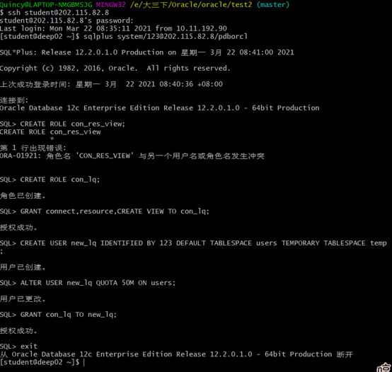
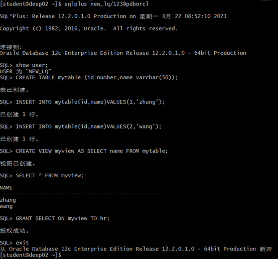
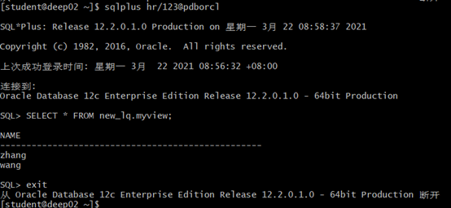
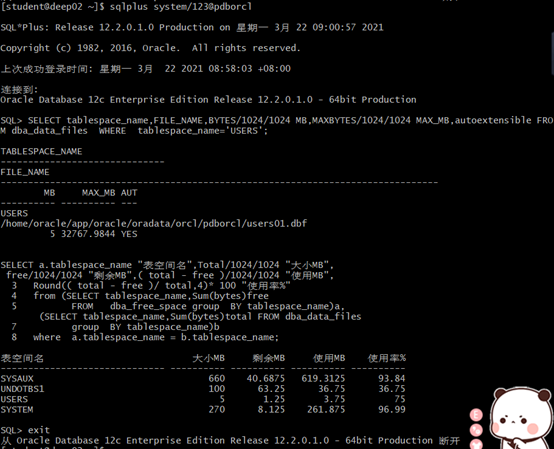

# 
实验2：用户及权限管理
#### 
4班-刘倩-201810414403
## 实验目的
### 掌握用户管理、角色管理、权限维护与分配的能力，掌握用户之间共享对象的操作技能。
## 实验内容
### Oracle有一个开发者角色resource，可以创建表、过程、触发器等对象，但是不能创建视图。本训练要求：
#### (以下con_lq和new_lq均为此次实验自己创建的姓名缩写角色)
### （1）在pdborcl插接式数据库中创建一个新的本地角色con_lq，该角色包含connect和resource角色，同时也包含CREATE VIEW权限，这样任何拥有con_lq的用户就同时拥有这三种权限。
### （2）创建角色之后，再创建用户new_lq，给用户分配表空间，设置限额为50M，授予con_lq角色。
### （3）最后测试：用新用户new_lq连接数据库、创建表，插入数据，创建视图，查询表和视图的数据。
## 实验步骤
### 第1步：以system登录到pdborcl，创建角色con_lq和用户new_user，并授权和分配空间
#### 首先用ssh student@202.115.82.8登录服务器
#### 然后以system登录到pdborcl
#### 创建角色用CREATE ROLE con_lq;
#### 为角色授权GRANT connect,resource,CREATE VIEW TO con_lq;
#### 创建用户new_lq：CREATE USER new_lq IDENTIFIED BY 123 DEFAULT TABLESPACE users TEMPORARY TABLESPACE temp; 
#### 授权new_user用户访问users表空间，空间限额是50M：ALTER USER new_lq QUOTA 50M ON users;
#### GRANT con_lq TO new_lq;再次授权
#### 具体操作过程如图1

### 第2步：新用户new_user连接到pdborcl，创建表mytable和视图myview，插入数据，最后将myview的SELECT对象权限授予hr用户。
#### 显示用户有哪些：show user;
#### 创建一张包含id和name的表：CREATE TABLE mytable (id number,name varchar(50));
#### 在表中插入第一组数据：INSERT INTO mytable(id,name)VALUES(1,'zhang');
#### 在表中再次插入数据：INSERT INTO mytable(id,name)VALUES (2,'wang');
#### 创建视图：CREATE VIEW myview AS SELECT name FROM mytable;
#### 显示myview：SELECT * FROM myview;
#### 将myview的SELECT对象权限授予hr用户：GRANT SELECT ON myview TO hr;
#### 具体操作过程及结果如图2

### 第3步：用户hr连接到pdborcl，查询new_lq授予它的视图myview。
#### 先连接：sqlplus hr/123@pdborcl
#### 再查询：SELECT * FROM new_user.myview;
#### 具体结果如下图图3所示

### 查看数据库的使用情况。
#### 查看表空间的数据库文件，以及每个文件的磁盘占用情况。
#### autoextensible是显示表空间中的数据文件是否自动增加。
#### MAX_MB是指数据文件的最大容量。
#### 具体步骤及结果如下图图4所示：

