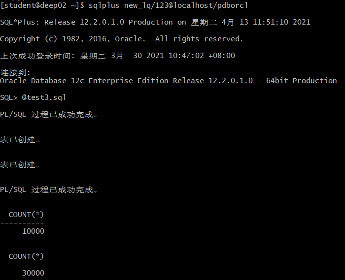
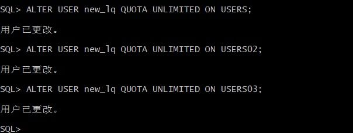
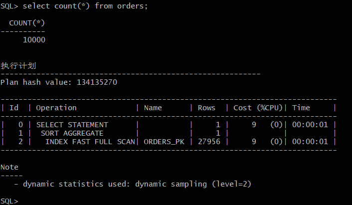
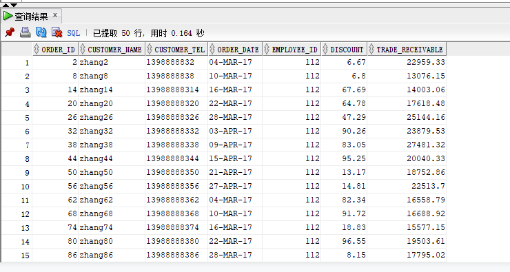
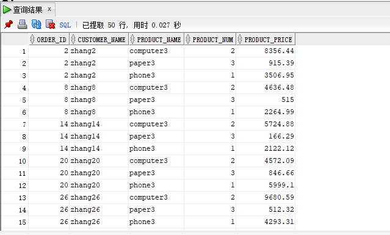
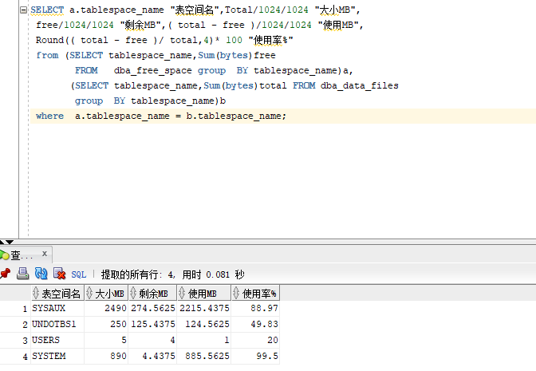
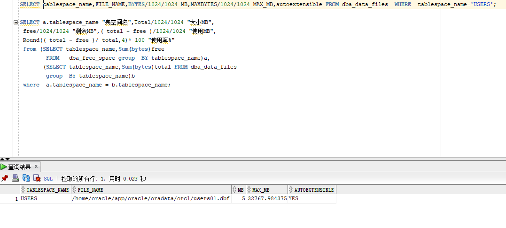

# 实验3：创建分区表
刘倩 软件18-4 学号：201810414403
---
用户名：new_lq

## 实验目的：

掌握分区表的创建方法，掌握各种分区方式的使用场景。

## 实验内容：
（1）本实验使用3个表空间：USERS,USERS02,USERS03。在表空间中创建两张表：订单表(orders)与订单详表(order_details)。
（2）使用你自己的账号创建本实验的表，表创建在上述3个分区，自定义分区策略。
（3）你需要使用system用户给你自己的账号分配上述分区的使用权限。你需要使用system用户给你的用户分配可以查询执行计划的权限。
（4）表创建成功后，插入数据，数据能并平均分布到各个分区。每个表的数据都应该大于1万行，对表进行联合查询。
（5）写出插入数据的语句和查询数据的语句，并分析语句的执行计划。
（6）进行分区与不分区的对比实验。

## 实验步骤：
### 1、创建两个分区

### 2、更改用户权限,使用system用户给自己的账号分配上述分区的使用权限

### 3、查询插入条数

### 4、编写查询语句
--以system用户运行：
set autotrace on
select * from your_user.orders where order_date
between to_date('2017-1-1','yyyy-mm-dd') and to_date('2018-6-1','yyyy-mm-dd');

select a.ORDER_ID,a.CUSTOMER_NAME,
b.product_name,b.product_num,b.product_price
from your_user.orders a,your_user.order_details b where
a.ORDER_ID=b.order_id and
a.order_date between to_date('2017-1-1','yyyy-mm-dd') and to_date('2018-6-1','yyyy-mm-dd');

#### 查看数据库使用情况
以下样例查看表空间的数据库文件，以及每个文件的磁盘占用情况。
$ sqlplus system/123@pdborcl
 * autoextensible是显示表空间中的数据文件是否自动增加。
 * MAX_MB是指数据文件的最大容量。**

