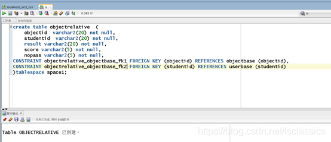
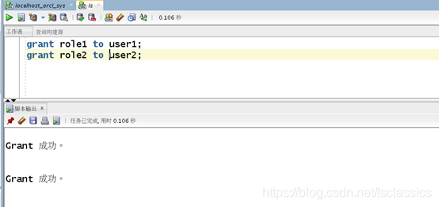
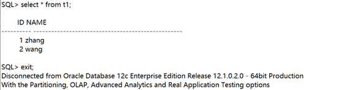

# 实验6（期末考核）：基于Oracle的学生信息管理系统的数据库库设计
#### 刘倩 软工4班 201810414403
- 期末考核要求

  - 自行设计一个信息系统的数据库项目，自拟```某项目```名称。
  - 设计项目涉及的表及表空间使用方案。至少5张表和5万条数据，两个表空间。
  - 设计权限及用户分配方案。至少两类角色，两个用户。
  - 在数据库中建立一个程序包，在包中用PL/SQL语言设计一些存储过程和函数，实现比较复杂的业务逻辑，用模拟数据进行执行计划分析。
  
  - 设计自动备份方案或则手工备份方案。
  - 设计容灾方案。使用两台主机，通过DataGuard实现数据库整体的异地备份(可选)。

## 实验注意事项，完成时间： 2021-6-15日前上交

- 实验在自己的计算机上完成。
- 文档`必须提交`到你的Oracle项目中的test6目录中。文档必须上传两套，因此你的test6目录中必须至少有两个文件：
  - 一个是Markdown格式的，文件名称是test6.md。
  - 另一个是Word格式的，文件名称是test6_design.docx。参见[test6_design.docx](./test6_design.docx)，文件不用打印。
- 上交后，通过这个地址应该可以打开你的源码：https://github.com/你的用户名/oracle/tree/master/test6
- 文档中所有设计和数据都必须是你自己独立完成的真实实验结果。不得抄袭，杜撰。

## 评分标准

| 评分项     | 评分标准                     | 满分 |
| :--------- | :--------------------------- | :--- |
| 文档整体   | 文档内容详实、规范，美观大方 | 10   |
| 表设计     | 表，表空间设计合理，数据合理 | 20   |
| 用户管理   | 权限及用户分配方案设计正确   | 20   |
| PL/SQL设计 | 存储过程和函数设计正确       | 30   |
| 备份方案   | 备份方案设计正确             | 20   |


## 一、数据库创建过程
#### 1、创建数据库
```create pluggable database lspdb admin user ls identified by 123
file_name_convert=('/home/oracle/app/oracle/oradata/orcl/pdbseed/',' 
/home/oracle/ app/oracle/oradata/orcl/lspdb');
```


#### 2、为管理员赋予权限
```
alter session set container=lspdb;
alter database open;
grant dba to ls;
```


#### 3、创建表空间
```
在christpdb数据库中创建了表空间USER01，表空间USER02,表空间USER03,表空
间USER04
```
```
create tablespace 
space1
datafile '/home/oracle/app/oracle/oradata/orcl/lspdb/space1.dbf' 
size 150M 
autoextend on next 50m
maxsize unlimited;
create tablespace 
space2
datafile '/home/oracle/app/oracle/oradata/orcl/lspdb/space2.dbf' 
size 150M 
autoextend on next 50m
maxsize unlimited;
create tablespace 
space3
datafile '/home/oracle/app/oracle/oradata/orcl/lspdb/space3.dbf' 
size 150M 
autoextend on next 50m
maxsize unlimited;
create tablespace 
space4
datafile '/home/oracle/app/oracle/oradata/orcl/lspdb/space4.dbf' 
size 150M 
autoextend on next 50m
maxsize unlimited;
```


#### 4、查看
```
查看数据库的使用情况，即查看表空间的数据库文件，以及每个文件的磁盘占用情况；
```
```
SELECT tablespace_name,FILE_NAME,BYTES/1024/1024 MB,MAXBYTES/1024/1024 
MAX_MB,autoextensible FROM dba_data_files WHERE tablespace_name='USERS';
SELECT a.tablespace_name "表空间名",Total/1024/1024 "大小MB",
free/1024/1024 "剩余MB",( total - free )/1024/1024 "使用MB",
Round(( total - free )/ total,4)* 100 "使用率%"
from (SELECT tablespace_name,Sum(bytes)free
FROM dba_free_space group BY tablespace_name)a,
(SELECT tablespace_name,Sum(bytes)total FROM dba_data_files group BY tablespace_name)b
where a.tablespace_name = b.tablespace_name;
```


#### 5、创建表
```
create table classbase (
classid varchar2(20) not null primary key,
classname varchar2(20) not null,
credit varchar2(50) not null
)TABLESPACE space1;

create table objectbase (
objectid varchar2(20) not null primary key,
objectname varchar2(20) not null
)TABLESPACE space1;

create table userlogin(
userid varchar2(20) not null primary key,
password varchar2(20) not null,
usertype varchar(10) not null,
)TABLESPACE space1;


create table userbase(
userid varchar2(20) not null,
studentid varchar2(20) not null primary key,name varchar2(20) not null,
subject varchar2(20) not null,year_DATE DATE NOT NULL
classid varchar2(20) not null,
CONSTRAINT userbase_ classbase _fk1 FOREIGN KEY(classid) REFERENCES 
	classbase (classid)) partition by range (year_DATE)
(
partition p1 values LESS THAN (TO_DATE(' 2018-01-01 00:00:00', 'SYYYY-MM-DD HH24:MI:SS',
	'NLS_CALENDAR=GREGORIAN')) tablespace space1,

partition p2 values LESS THAN (TO_DATE(' 2019-01-01 00:00:00', 'SYYYY-MM-DD HH24:MI:SS',
	'NLS_CALENDAR=GREGORIAN')) tablespace space2,

partition p3 values LESS THAN (TO_DATE(' 2020-01-01 00:00:00', 'SYYYY-MM-DD HH24:MI:SS',
	'NLS_CALENDAR=GREGORIAN')) tablespace space3,

partition p4 values LESS THAN (MAXVALUE) tablespace space4);

create table objectrelative (
objectid varchar2(20) not null,
studentid varchar2(20) not null,
result varchar2(20) not null,
score varchar2(5) not null,
nopass varchar2(5) not null,
CONSTRAINT objectrelative _ objectbase _fk1 FOREIGN KEY (objectid) REFERENCES objectbase (objectid),
CONSTRAINT objectrelative _ objectbase _fk1 FOREIGN KEY (studentid) REFERENCES userbase (studentid)
)tablespace space1;
```



#### 6、创建用户和角色
```
A、分别创建两个用户user1和user2,,并授权和分配表空间space1；
create user user1 IDENTIFIED by 123;
create user user2 IDENTIFIED by 123;
alter user user1 quota unlimited on space1;
alter user user2 quota unlimited on space1;
```

```
B、创建两个角色cb_role1，cb_role2，并分别赋予cb_role1，cb_role2读任何表和
读、修改任何表的权利；
create role role1;
create role role2;
grant select any table to role1;
grant select any table to role2;
grant update any table to role2;
```

#### 7、角色分配
```
将cb_role1，cb_role2分别赋予给用户cb_user1，cb_user2：
grant role1 to user1;
grant role2 to user2;
```

#### 8、向表中插入数据
```
declare
dt date;
dan_no char(5);
zhan_no char(5);
dan_class char(15);
exit_ char(20);
price float;
begin
insert into classbase (classid ,classname ,credit) values ('1001','软工1班','计算机');
insert into classbase (classid ,classname ,credit) values ('1002','软工2班','计算机');
insert into classbase (classid ,classname ,credit) values ('1003','软工3班','计算机');
insert into classbase (classid ,classname ,credit) values ('1005','学前3班','教育');
insert into classbase (classid ,classname ,credit) values ('1006','学前2班','教育');
insert into classbase (classid ,classname ,credit) values ('1004','学前1班','教育');
insert into objectbase (objectid,objectname) values ('0005','马克思');
insert into objectbase (objectid,objectname) values ('0006','毛概');
insert into objectbase (objectid,objectname) values ('0007','历史');
insert into objectbase (objectid,objectname) values ('0011','离散');
insert into objectbase (objectid,objectname) values ('0012','概率');
for i in 1..50000
loop
if i mod 3 =0 then
dt:=to_date('2018-01-01','yyyy-mm-dd')+(i mod 60); 
--PARTITION_2018
elsif i mod 6 =1 then
dt:=to_date('2019-01-01','yyyy-mm-dd')+(i mod 60); 
--PARTITION_2019
elsif i mod 6 =2 then
dt:=to_date('2020-01-01','yyyy-mm-dd')+(i mod 60); 
--PARTITION_2020
end if;
dan_no := i;
zhan_no := case i mod 6 when 0 
	then '1001' when 1 then '1002' when 2
	 	then '1003' when 4 then '1004' else '1005'end;
dan_class := CASE i MOD 6 WHEN 0 
	THEN '马克思' WHEN 1 THEN '毛概' WHEN 2
 		THEN'历史'WHEN 3 THEN '离散' ELSE '概率' END;
 		
exit_ := CASE i MOD 2 WHEN 0 THEN '是' ELSE '否' end;
price := dbms_random.value(5,30);
insert into userbase (dan_no,zhan_no,dan_class,exit_,price,dan_date)
values (dan_no,zhan_no,dan_class,exit_,price,dt);
end loop;
end;
```

#### 9、连接验证与表空间使用情况查看
```
让user1连接数据库lspdb,让其查看ls的userbase表;
```
```
grant connect to user1;
grant connect to user2;
```

```
SELECT * FROM CLASSBASE;
SELECT * FROM USERBASE;
```

```
验证表空间使用情况：userbase表中的year_DATE字段根据时间段的不同，将其放在了不同的表空间里面,验证表空间使用情况如下：
```

## 二、建立程序包
#### 1、建立一个程序包
```
建立一个程序包，里面有一个函数和一个存储过程，其功能分别为：统计一段时间内的
挂号总收入；统计一段时间内，各个用户表的挂号数。具体过程如下：
```
```
create or replace PACKAGE function1 IS
FUNCTION Get_TOTAL(dt1 char,dt2 char) RETURN NUMBER;
PROCEDURE get_people(dt1 char,dt2 char);
END function1;

create or replace PACKAGE BODY function1 IS
FUNCTION Get_TOTAL(dt1 char,dt2 char) RETURN NUMBER
AS
N NUMBER;
BEGIN
select sum(price) into N from WEIXIUDAN where DAN_DATE >= 
to_date(dt1,'yyyy-mm-dd hh24:mi:ss')
and DAN_DATE <= to_date(dt2,'yyyy-mm-dd hh24:mi:ss');
RETURN N;
END;

PROCEDURE get_people(dt1 char,dt2 char)
AS
a1 NUMBER;
b1 NUMBER;
c1 NUMBER;
d1 NUMBER;
e1 NUMBER;
f1 NUMBER;
cursor cur is
select * from WEIXIUDAN where DAN_DATE >= to.date
(dt1,'yyyy-mm-dd hh24:mi:ss')
and DAN_DATE <= to_date(dt2,'yyyy-mm-dd hh24:mi:ss');
begin
a1 := 0;
b1 := 0;
c1 := 0;
d1 := 0;
e1 := 0;
f1 := 0;
--使用游标
for v in cur 
LOOP
if v.dan_class = '马克思'
then a1 := a1 + 1;
elsif v.dan_class = '毛概'
then b1 := b1 + 1;
elsif v.dan_class = '历史'
then c1 := c1 + 1;
elsif v.dan_class = '离散'
then d1 := d1 + 1;
elsif v.dan_class = '概率'
then e1 := e1 + 1; 
end if;
END LOOP;
DBMS_OUTPUT.PUT_LINE('马克思为：' || a1);
DBMS_OUTPUT.PUT_LINE('毛概为：' || b1);
DBMS_OUTPUT.PUT_LINE('历史为：' || c1);
DBMS_OUTPUT.PUT_LINE('离散为：' || d1);
DBMS_OUTPUT.PUT_LINE('概率为：' || e1);
end;
END function1;
```


## 三、备份
#### 1、开始全备份
```
步骤1：cat rman_level0.sh
```

```
步骤2：./rman_level0.sh
```

#### 2、查看备份文件
```
*.log是日志文件
dblv0*.bak是数据库的备份文件
arclv0*.bak是归档日期的备份文件
c-1392946895-20191120-01是控制文件和参数的备份
```

#### 3、查看备份文件的内容
```
rman target /
RMAN> list backup;
```


#### 4、备份后修改数据
```
sqlplus study/123@pdborcl；
create table t1 (id number,name varchar2(50));
insert into t1 values(1,'zhang');
commit;
```

查看修改情况：select * from t1;

#### 5、删除数据库文件，模拟数据库文件损坏
```
rm /home/oracle/app/oracle/oradata/orcl/pdborcl/SAMPLE_SCHEMA_users01.dbf;

--删除数据库文件后修改数据：删除数据文件后，仍然可以增加一条数据。这是因为
--增加的数据并没有写入数据文件，而是写到了日志文件中。如果增加的数据较多的
--时候，就会出问题了；
sqlplus study/123@pdborcl；
insert into t1 values(2,'wang');
commit;
```



#### 6、重启损坏的数据库到mount状态
```
通过**shutdown immediate**无法正常关闭数据库，只能通过shutdown abort强制关闭。然
后将数据库启动到mount状态。
```


#### 7、开始恢复数据库
```
rman target /;
[RMAN>] : restore database ;
recover database;
alter database open;
```


#### 8、查询数据库是否恢复


## 四、容灾设计
#### 1、两种备份方式介绍
```
物理备库：
	physical standby, 备库与主数据库完全一样的备份（数据为物理块到块的复制)，数据库的
表和索引都相同，物理结构是相同的。基于RMAN实现，传输和直接应用redo log来实现。

逻辑备库：
	logical standby，逻辑备库，standby侧的逻辑信息是一样的，物理信息和数据结构是不同
的，其实现原理是将redo log中的信息提取出SQL，然后在standby执行相应的SQL语句。		
	logical standy数据库是可以OPEN的，也可以用户数据库用户的查询和报表，但要求数据
库表必须有	primary key. —此项待查，实验进行相应的验证。
```
#### 2、DG的三种数据保护模式
```
最大保护模式： 
	max protection, 数据零丢失，数据双至多重数据保障。它要求所有的事务在提交前其
redo不仅被写入到本地的online redo log，还要同时提交到standby数据库的standby redo 
log，并确认redo数据至少在一个standby数据库可用(如果有多个的话)，然后才会在
primary数据库上提交。如果出现了什么故障导致standby数据库不可用的话，primary数据
库会被shutdown。LGWR SYNC将数据同步传输，如遇到网络故障，如网络中断，则主库
会down机。

最大可用模式：
	max availability,数据零丢失，LGWR SYNC数据同步传输。 all redo data has 
	been written to online redo log and at least one of the standy db’s 
	online redo log , thetransaction 才提交。若redo stream不能同时写入到
	synchronized standby db, 则 会按照maxinum performance操作，直到可以同步
	写入的时候。

最高性能模式：
	max performanc， 数据最少丢失，因为使用LGWR和ARCH来做数据库的异步传输的
应用。 事务可以随时提交,当前primary库中的redo数据至少要保证写入到一个standby数
据库中。如果网络条件理想的话，这种模式能够提供类似最高可用性的数据保护而仅对
primary数据库有轻微的性能影响。
```
